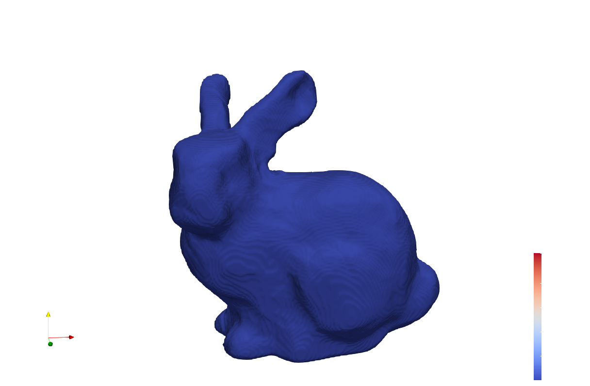
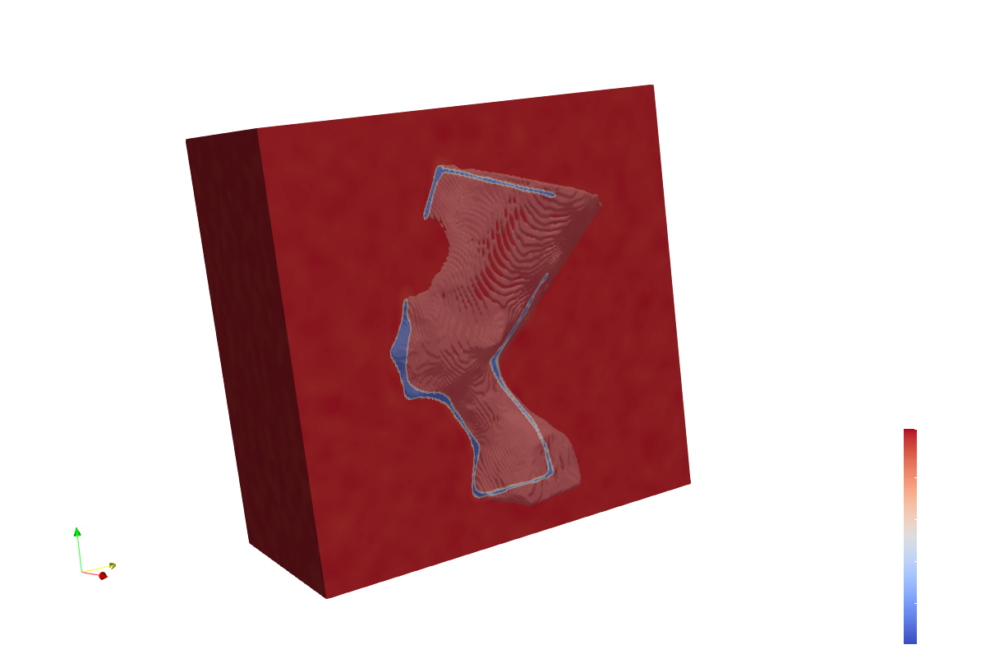
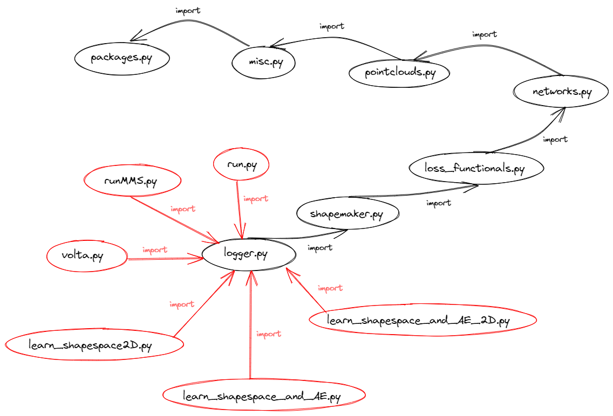

# Table of Contents
1. [About](#example)
2. [How to install](#How-to-install)
3. [Files](#third-example)
4. [Imports](#imports)
5. [External Packages](External-packages)


# About
This is an implementation based on my Master Thesis

* [Learning Geometric Phase Field representations]([https://drive.google.com/drive/u/0/folders/1LKQha7mYWvPzKKS2yC0zf_19FEzRlly8](https://drive.google.com/file/d/1lEK0yFL-ETgClx6Ld0mv3deVr2opwhrb/view?usp=share_link)) (Yannick Kees 2022)

The area of computer graphics is a field of mathematics and computer science that deals with creating and manipulating visual content. One central question in computer graphics is the best way to represent three-dimensional data effectively. Most conventional approaches approximate the object’s surface discretely, for example, with meshes. One problem with these approaches is that spatial discretization limits them, just as the display of an image is limited by its number of pixels. Another popular approach is implicit representation, in which the object is written as the level set of an appropriate function. Instead of discretizing the output domain, we can now discretize the space of available functions. In this thesis, we deal with how to find such a function. To this end, we place a particular focus on phase field functions. These functions are, for the most part, constant, with a smooth transition along the surface where the value of the function changes. We distinguish between two different models: the Modica-Mortola approach,in which there are two different phases for an interior and exterior, and the Ambrosio-Tortorelli approach, in which there is only one phase. Calculating these functions is very challenging. Therefore we use deep learning, i.e., neural networks, to approximate the phase fields. The starting points for all our calculations are sets of points sampled from the surfaces of the objects. Learning implicit functions using the Modica-Mortola approach has been introduced in [Phase Transitions, Distance Functions, and Implicit Neural Representations](https://arxiv.org/abs/2106.07689). The new approach Ambrosio-Tortorelli approach in this work based on [Approximation of Functionals Depending on Jumps by Elliptic Functionals via $\Gamma$-Convergence](https://onlinelibrary.wiley.com/doi/pdf/10.1002/cpa.3160430805). Using this new approach, we will also be able to process open surfaces, which was impossible before. To do this, we distinguish two different tasks. The first goal will be to train a network to match the phase field for a single 3D object. In the second step, we will train a network that can
represent the phase fields for several objects at once. Therefore, the network receives additional object-specific input. 

*Reconstruction of a square*
*Reconstruction of a bunny*
*Reconstruction of the nefreteti statue*


# How to install:
1. ssh .... & enter password
2. install conda using wget URL, bash~/Anaconda, conda env list
Then type 
```shell
source ~/anaconda3/bin/activate
conda create -n pytorch3d python=3.10
conda activate pytorch3d
conda install pytorch torchvision torchaudio cudatoolkit=11.3 -c pytorch
conda install -c fvcore -c iopath -c conda-forge fvcore iopath
conda install -c bottler nvidiacub
conda install pytorch3d -c pytorch3d
pip install matplotlib
pip install random-fourier-features-pytorch 
pip install k3d
git clone https://github.com/paulo-herrera/PyEVTK
cd PyEVTK
python setup.py install
git clone https://github.com/Yannick-Kees/Masterarbeit
cd Masterarbeit
```


Get files from volta using 
```
scp IP_ADRESS:~\Masterarbeit\structured2560.vts C:\Users\Yannick\Desktop
```


# Files

| File | Description |
| --- | --- |
| `dataset.py` | Creates and Visualises Datasets. It can create datasets from generated objects or from a given directory of files |
| `interpolation.py` | Interpolation between to shapes of the shape space. The functions get as input the different shape space indices and interpolate the computed latent coordinates |
| `learn_shapespace_and_AE_2D.py` | Trains Shape space network together with the Encoder on 2D examples |
| `learn_shapespace_and_AE.py` | Trains Shape space network together with the Encoder on 3D examples |
| `learn_shapespace2D.py` | Trains Shape space network on 2D examples. The ground truth feature vectors are known and entered into the network. |
| `logger.py` | Denotes the loss over time in a file and also saves a copy of the current version of the executeable python script  |
| `loss_functionals.py` | Computes Modica-Mortola and Ambrosio-Tortorelli. There are different versions for the shape space learning and the surface reconstruction parts  |
| `misc.py` | Handles import of different file formates, enables CUDA and shows progress on console  |
| `networks.py` | Neural Networks  |
| `packages.py` | All used third party packages |
| `pointclouds.py` | Creates or changes point clouds |
| `run.py` | Solves the 2D reconstruction problem. Can be executed on any computer |
| `runMMS.py` | Deep minimizing movement scheme |
| `shapemaker.py` | Programm that can produce random point clouds in 2D or 3D form metaballs |
| `test_autoencoder.py` | Plot inputs and outputs of Autoencoder for differnt shapes of dataset  |
| `test_shape_space.py` | Make plots of elements of shape space after training  |
| `train_autoencoder.py` | Train PointNet - Autoencoder for the different datasets  |
| `visualizing.py` | Handles visualization of input and output data |
| `volta.py` | Solves the 3D reconstruction problem. Should only be executed on high performance computer |


General workflow:
- Create dataset in dataset.py. A dataset is a Nx2xPxd dimensional matrix
- Use dataset in one of the executable files: learn_shapespace_and_AE_2d.py, 
- In these files, you can turn the global parameters at the beginning of the file
- The Neural Network should be 'ParkEtAl' for the single shape learning and 'FeatureSpaceNetwork2' for the shape space learning. (The difference to FeatureSpaceNetwork is that the feature vector is concatenate to the input, after the input passes the Fourier layer. In FeatureSpaceNetwork the feature is directly 
concatenated to the input and the concatenation is passed through the fourier layer)
- Changing the Neural Network: The brackets contain the indices of layers, that get a skipping connection from the input layer
- The true number of fourier features is = num_features * 2 * input_dimension
- Run file on volta
- Copy autoencoder and shapespace network to local pc
- Run test_shape_space file 
- Done :)


# Imports

All packages are connected in series as you can see here:

*Imports*

# External packages:
* [Random Fourier Features Pytorch](https://github.com/jmclong/random-fourier-features-pytorch)  
* [K3D Jupyter](https://github.com/K3D-tools/K3D-jupyter)  <- bad renderer, not important
* [EVTK (Export VTK) ](https://github.com/paulo-herrera/PyEVTK) <- exports 3D examples for paraview
* [PointNet Autoencoder](https://github.com/charlesq34/pointnet-autoencoder/tree/cc270113da3f429cebdbe806aa665c1a47ccf0c1) 
* [PyTorch3D](https://pytorch3d.readthedocs.io/en/latest/modules/loss.html) <- Chamfer Distance

